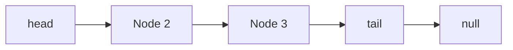
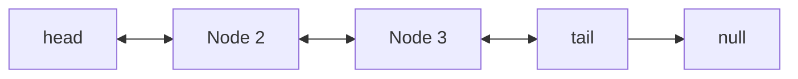
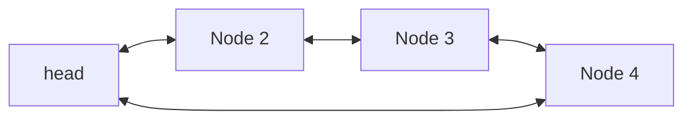

Unlike arrays, linked lists are dynamic and can efficiently insert or remove elements without reallocation or reorganization of the entire structure because the items don’t need to be stored contiguously. A linked list is made up of nodes, where each node contains a data field and a reference (or link) to the next node in the sequence.
There are several types of linked lists:

* __Singly linked list__ - Each node consists `data` field and `next` link to following node.

* __Doubly linked list__ - Each node consists `data` field, `next` link to following node, and `prev` link to previous node.


* __Cicular linked list__ - This could be a singly or doubly linked list with the exception of *last node linked to the first node*.



### Advantages
1. __Dynamic size__: LL's are more flexible than static data structures like arrays.
2. __Easy Insert/Remove__: Insertion or removal of nodes in LLs is often faster than in arrays.


### Disadvantages
1. __Memory__: Each node requires extra storage for pointers.
2. __No direct access__: Traversing the list from `head` is reuired to reach the target node.


## Operations

* Create

=== "Python"
    ```py
    class Node:
        def __init__(self, val, next=None, prev=None):
            self.data = val
            self.next = next
            self.prev = prev

    head = Node(1, None, None)
    tail = head
    ```
=== "C++"
    ```cpp
    struct Node {
        int data;
        Node* next;
        Node* prev;
        # constructor for struct
        Node(int val): data(val), next(nullptr), prev(nullptr) {}
    }

    int main(){
        Node* head = new Node(1);
        Node* tail = head;
        return 0;
    }
    ```

* Insert
=== "Python"
    ```py
    new_node = Node(2)
    tail.next = new_node
    tail = tail.next
    ```
=== "C++"
    ```cpp
    new_node = new Node(2);
    tail->next = new_node;
    tail = tail->next;
    ```

* Search
=== "Python"
    ```py
    def search(target):
        curr = head
        while curr and curr.data != target: # traverse the list until target found
            curr = curr.next
        return curr # returns target node or None if target doesn't exist
    ```
=== "C++"
    ```cpp
    Node* search(int target){
        Node* curr = head;
        while (curr != nullptr && curr->data != target){
            curr = curr->next;
        }
        return curr;
    }
    ```

- Remove
!!! note
    Easy to remove node in a double linked list (see below). For a singly linked list, find the node just before the target. 
=== "Python"
    ```py
    def remove(target):
        t_node = search(target)
        if not t_node: return # exit function if target doesnt exist
        # update next and prev links
        t_node.prev.next = t_node.next
        t_node.next.prev = t_node.prev
        del t_node
    ```
=== "C++"
    ```cpp
    void remove(int target){
        Node* t_node = search(target);
        if (t_node == nullptr){return;}
        t_node->prev->next = t_node->next;
        t_node->next->prev = t_node->prev;
        delete t_node;
    }
    ```
!!! Question "How to traverse LL and reach the __last node__?"
    